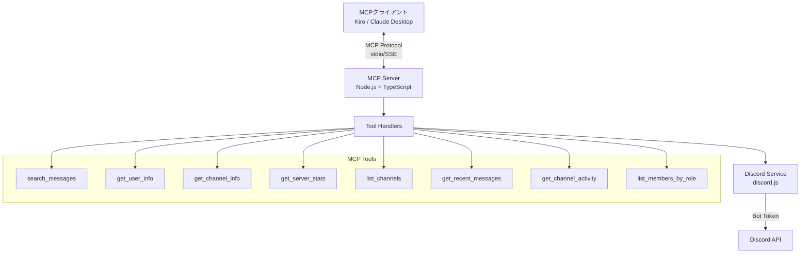

# Design Document

## Overview

Discord POSSE MCP Serverは、Model Context Protocol (MCP)を実装したサーバーで、POSSEのDiscordサーバー情報へのアクセスを提供します。KiroやClaude DesktopなどのMCPクライアントから、構造化されたツールを通じてDiscord情報を取得できます。

**提供機能:**

基本機能:
- メッセージ検索（日付範囲、作成者、チャンネル名、スレッド対応）
- ユーザー情報取得
- チャンネル情報取得
- サーバー統計取得

拡張機能:
- チャンネル一覧取得
- 最近のメッセージ取得
- チャンネルアクティビティ分析
- ロール別メンバー一覧

このシステムは以下の主要コンポーネントで構成されます：
- MCPサーバー（Node.js/TypeScript）：MCPプロトコル実装とツール提供
- Discord API統合層：discord.jsを使用したDiscord APIとの通信
- ツールハンドラー：各MCPツールの実装ロジック
- チャンネル名解決サービス：チャンネル名からIDへの変換

## Architecture

### System Architecture Diagram



### Technology Stack

**MCPサーバー:**
- Node.js 18+
- TypeScript
- @modelcontextprotocol/sdk（MCP SDK）
- discord.js（Discord API クライアント）

**通信プロトコル:**
- MCP over stdio（標準入出力）
- MCP over SSE（Server-Sent Events）- オプション

**認証:**
- Discord Bot Token
- dotenv（環境変数管理）

## Components and Interfaces

### 1. MCP Server Core

#### MCPServer Class
MCPプロトコルの実装とツール管理

```typescript
import { Server } from '@modelcontextprotocol/sdk/server/index.js';
import { StdioServerTransport } from '@modelcontextprotocol/sdk/server/stdio.js';

class MCPServer {
  private server: Server;
  private discordService: DiscordService;
  
  constructor() {
    this.server = new Server(
      {
        name: 'discord-posse-server',
        version: '1.0.0',
      },
      {
        capabilities: {
          tools: {},
        },
      }
    );
    
    this.setupToolHandlers();
  }
  
  private setupToolHandlers(): void {
    // ツールリストの登録
    // ツール実行ハンドラーの登録
  }
  
  async start(): Promise<void> {
    const transport = new StdioServerTransport();
    await this.server.connect(transport);
  }
}
```

### 2. Tool Handlers

#### SearchMessagesHandler
メッセージ検索ツールの実装

```typescript
interface SearchMessagesParams {
  query: string;
  channel_id?: string;
  limit?: number;
}

async function handleSearchMessages(
  params: SearchMessagesParams
): Promise<ToolResult> {
  // パラメータのバリデーション
  // DiscordServiceを使用してメッセージ検索
  // 結果のフォーマット
  return {
    content: [
      {
        type: 'text',
        text: JSON.stringify(messages, null, 2)
      }
    ]
  };
}
```

#### GetUserInfoHandler
ユーザー情報取得ツールの実装

```typescript
interface GetUserInfoParams {
  username?: string;
  user_id?: string;
}

async function handleGetUserInfo(
  params: GetUserInfoParams
): Promise<ToolResult> {
  // パラメータのバリデーション
  // DiscordServiceを使用してユーザー情報取得
  // 結果のフォーマット
  return {
    content: [
      {
        type: 'text',
        text: JSON.stringify(userInfo, null, 2)
      }
    ]
  };
}
```

#### GetChannelInfoHandler
チャンネル情報取得ツールの実装

```typescript
interface GetChannelInfoParams {
  channel_id: string;
}

async function handleGetChannelInfo(
  params: GetChannelInfoParams
): Promise<ToolResult> {
  // DiscordServiceを使用してチャンネル情報取得
  return {
    content: [
      {
        type: 'text',
        text: JSON.stringify(channelInfo, null, 2)
      }
    ]
  };
}
```

#### GetServerStatsHandler
サーバー統計取得ツールの実装

```typescript
async function handleGetServerStats(): Promise<ToolResult> {
  // DiscordServiceを使用してサーバー統計取得
  return {
    content: [
      {
        type: 'text',
        text: JSON.stringify(stats, null, 2)
      }
    ]
  };
}
```

#### ListChannelsHandler
チャンネル一覧取得ツールの実装

```typescript
interface ListChannelsParams {
  type?: 'text' | 'voice' | 'category' | 'announcement' | 'forum';
}

async function handleListChannels(
  params: ListChannelsParams
): Promise<ToolResult> {
  // DiscordServiceを使用してチャンネル一覧取得
  // typeパラメータでフィルタリング
  return {
    content: [
      {
        type: 'text',
        text: JSON.stringify(channels, null, 2)
      }
    ]
  };
}
```

#### GetRecentMessagesHandler
最近のメッセージ取得ツールの実装

```typescript
interface GetRecentMessagesParams {
  channel_id?: string;
  channel_name?: string;
  limit?: number;
}

async function handleGetRecentMessages(
  params: GetRecentMessagesParams
): Promise<ToolResult> {
  // チャンネル名からIDを解決
  // DiscordServiceを使用して最近のメッセージ取得
  return {
    content: [
      {
        type: 'text',
        text: JSON.stringify(messages, null, 2)
      }
    ]
  };
}
```

#### GetChannelActivityHandler
チャンネルアクティビティ分析ツールの実装

```typescript
interface GetChannelActivityParams {
  channel_id?: string;
  channel_name?: string;
  after?: string;
  before?: string;
}

async function handleGetChannelActivity(
  params: GetChannelActivityParams
): Promise<ToolResult> {
  // チャンネル名からIDを解決
  // DiscordServiceを使用してアクティビティ統計を計算
  return {
    content: [
      {
        type: 'text',
        text: JSON.stringify(activity, null, 2)
      }
    ]
  };
}
```

#### ListMembersByRoleHandler
ロール別メンバー一覧ツールの実装

```typescript
interface ListMembersByRoleParams {
  role_name: string;
}

async function handleListMembersByRole(
  params: ListMembersByRoleParams
): Promise<ToolResult> {
  // DiscordServiceを使用してロール別メンバー取得
  return {
    content: [
      {
        type: 'text',
        text: JSON.stringify(members, null, 2)
      }
    ]
  };
}
```

### 3. Discord Service

#### DiscordService Class
Discord APIとの通信を担当

```typescript
import { Client, GatewayIntentBits } from 'discord.js';

class DiscordService {
  private client: Client;
  private guildId: string;
  private channelCache: Map<string, string>; // name -> id mapping
  
  constructor(botToken: string, guildId: string) {
    this.client = new Client({
      intents: [
        GatewayIntentBits.Guilds,
        GatewayIntentBits.GuildMessages,
        GatewayIntentBits.GuildMembers,
        GatewayIntentBits.MessageContent,
      ],
    });
    this.guildId = guildId;
    this.channelCache = new Map();
  }
  
  async connect(): Promise<void> {
    await this.client.login(process.env.DISCORD_BOT_TOKEN);
    await this.buildChannelCache();
  }
  
  // チャンネル名からIDへの変換キャッシュを構築
  private async buildChannelCache(): Promise<void> {
    // チャンネル一覧を取得してキャッシュに保存
  }
  
  // チャンネル名からIDを解決
  async resolveChannelId(channelName: string): Promise<string[]> {
    // キャッシュからチャンネルIDを検索
    // 複数のチャンネルが同じ名前を持つ場合は全て返す
  }
  
  async searchMessages(params: MessageSearchParams): Promise<Message[]> {
    // 拡張されたメッセージ検索の実装
    // - channel_name対応
    // - 日付範囲フィルタ
    // - 作成者フィルタ
    // - スレッド検索
  }
  
  async getUserInfo(userId: string): Promise<UserInfo> {
    // ユーザー情報取得の実装
  }
  
  async getChannelInfo(channelId: string): Promise<ChannelInfo> {
    // チャンネル情報取得の実装
  }
  
  async getServerStats(): Promise<ServerStats> {
    // サーバー統計取得の実装
  }
  
  async listChannels(type?: string): Promise<ChannelInfo[]> {
    // チャンネル一覧取得の実装
  }
  
  async getRecentMessages(channelId: string, limit: number): Promise<Message[]> {
    // 最近のメッセージ取得の実装
  }
  
  async getChannelActivity(channelId: string, after?: Date, before?: Date): Promise<ChannelActivity> {
    // チャンネルアクティビティ分析の実装
  }
  
  async listMembersByRole(roleName: string): Promise<UserInfo[]> {
    // ロール別メンバー一覧の実装
  }
}
```

### 4. MCP Tool Definitions

```typescript
const tools = [
  {
    name: 'search_messages',
    description: 'Search for messages in the POSSE Discord server with advanced filters',
    inputSchema: {
      type: 'object',
      properties: {
        query: {
          type: 'string',
          description: 'Search query to find messages',
        },
        channel_id: {
          type: 'string',
          description: 'Optional channel ID to limit search scope',
        },
        channel_name: {
          type: 'string',
          description: 'Optional channel name to limit search scope (alternative to channel_id)',
        },
        author_id: {
          type: 'string',
          description: 'Optional user ID to filter messages by author',
        },
        author_name: {
          type: 'string',
          description: 'Optional username to filter messages by author',
        },
        after: {
          type: 'string',
          description: 'Optional ISO 8601 timestamp to get messages after this date',
        },
        before: {
          type: 'string',
          description: 'Optional ISO 8601 timestamp to get messages before this date',
        },
        include_threads: {
          type: 'boolean',
          description: 'Whether to include thread messages (default: true)',
          default: true,
        },
        limit: {
          type: 'number',
          description: 'Maximum number of messages to return (default: 20, max: 50)',
          default: 20,
        },
      },
      required: ['query'],
    },
  },
  {
    name: 'get_user_info',
    description: 'Get information about a Discord user in the POSSE server',
    inputSchema: {
      type: 'object',
      properties: {
        username: {
          type: 'string',
          description: 'Username to search for',
        },
        user_id: {
          type: 'string',
          description: 'Discord user ID',
        },
      },
    },
  },
  {
    name: 'get_channel_info',
    description: 'Get information about a Discord channel',
    inputSchema: {
      type: 'object',
      properties: {
        channel_id: {
          type: 'string',
          description: 'Discord channel ID',
        },
      },
      required: ['channel_id'],
    },
  },
  {
    name: 'get_server_stats',
    description: 'Get statistics about the POSSE Discord server',
    inputSchema: {
      type: 'object',
      properties: {},
    },
  },
  {
    name: 'list_channels',
    description: 'List all channels in the POSSE Discord server',
    inputSchema: {
      type: 'object',
      properties: {
        type: {
          type: 'string',
          description: 'Optional channel type filter (text, voice, category, announcement, forum)',
          enum: ['text', 'voice', 'category', 'announcement', 'forum'],
        },
      },
    },
  },
  {
    name: 'get_recent_messages',
    description: 'Get recent messages from a channel',
    inputSchema: {
      type: 'object',
      properties: {
        channel_id: {
          type: 'string',
          description: 'Channel ID to get messages from',
        },
        channel_name: {
          type: 'string',
          description: 'Channel name to get messages from (alternative to channel_id)',
        },
        limit: {
          type: 'number',
          description: 'Maximum number of messages to return (default: 20, max: 100)',
          default: 20,
        },
      },
    },
  },
  {
    name: 'get_channel_activity',
    description: 'Get activity statistics for a channel',
    inputSchema: {
      type: 'object',
      properties: {
        channel_id: {
          type: 'string',
          description: 'Channel ID to analyze',
        },
        channel_name: {
          type: 'string',
          description: 'Channel name to analyze (alternative to channel_id)',
        },
        after: {
          type: 'string',
          description: 'Optional ISO 8601 timestamp to analyze activity after this date',
        },
        before: {
          type: 'string',
          description: 'Optional ISO 8601 timestamp to analyze activity before this date',
        },
      },
    },
  },
  {
    name: 'list_members_by_role',
    description: 'List all members with a specific role',
    inputSchema: {
      type: 'object',
      properties: {
        role_name: {
          type: 'string',
          description: 'Role name to filter members by',
        },
      },
      required: ['role_name'],
    },
  },
];
```

## Data Models

### Message
```typescript
interface Message {
  id: string;
  content: string;
  author: {
    id: string;
    username: string;
    displayName: string;
    avatar: string;
  };
  channel: {
    id: string;
    name: string;
  };
  timestamp: string; // ISO 8601 format
  attachments?: {
    id: string;
    filename: string;
    url: string;
    contentType: string;
  }[];
  embeds?: {
    title?: string;
    description?: string;
    url?: string;
  }[];
  thread?: {
    id: string;
    name: string;
    parentMessageId: string;
  };
  reactions?: {
    emoji: string;
    count: number;
  }[];
}
```

### UserInfo
```typescript
interface UserInfo {
  id: string;
  username: string;
  discriminator: string;
  displayName: string;
  avatar: string;
  roles: {
    id: string;
    name: string;
    color: string;
    position: number;
  }[];
  joinedAt: string; // ISO 8601 format
  status: 'online' | 'offline' | 'idle' | 'dnd';
  isBot: boolean;
}
```

### ChannelInfo
```typescript
interface ChannelInfo {
  id: string;
  name: string;
  type: 'text' | 'voice' | 'category' | 'announcement' | 'forum';
  topic?: string;
  position: number;
  parentId?: string;
  createdAt: string; // ISO 8601 format
  memberCount?: number; // voice channelsの場合
}
```

### ServerStats
```typescript
interface ServerStats {
  guildId: string;
  name: string;
  memberCount: number;
  onlineCount: number;
  channelCount: {
    total: number;
    text: number;
    voice: number;
    category: number;
  };
  roleCount: number;
  createdAt: string; // ISO 8601 format
  iconUrl?: string;
}
```

### ChannelActivity
```typescript
interface ChannelActivity {
  channelId: string;
  channelName: string;
  period: {
    start: string; // ISO 8601 format
    end: string; // ISO 8601 format
  };
  totalMessages: number;
  activeUsers: number;
  messagesPerDay: number;
  topAuthors: Array<{
    userId: string;
    username: string;
    messageCount: number;
  }>;
  peakHours: Array<{
    hour: number; // 0-23
    messageCount: number;
  }>;
}
```

### MessageSearchParams
```typescript
interface MessageSearchParams {
  query: string;
  channel_id?: string;
  channel_name?: string;
  author_id?: string;
  author_name?: string;
  after?: string; // ISO 8601 format
  before?: string; // ISO 8601 format
  include_threads?: boolean;
  limit?: number;
}
```

### ToolResult
```typescript
interface ToolResult {
  content: Array<{
    type: 'text' | 'image' | 'resource';
    text?: string;
    data?: string;
    mimeType?: string;
  }>;
  isError?: boolean;
}
```

## Error Handling

### MCP Error Codes

MCPプロトコルに準拠したエラーコードを使用：

```typescript
enum MCPErrorCode {
  // Standard JSON-RPC errors
  PARSE_ERROR = -32700,
  INVALID_REQUEST = -32600,
  METHOD_NOT_FOUND = -32601,
  INVALID_PARAMS = -32602,
  INTERNAL_ERROR = -32603,
  
  // Custom application errors
  RATE_LIMIT_ERROR = -32000,
  AUTHENTICATION_ERROR = -32001,
  PERMISSION_ERROR = -32002,
  NOT_FOUND_ERROR = -32003,
  DISCORD_API_ERROR = -32004,
}

interface MCPError {
  code: MCPErrorCode;
  message: string;
  data?: {
    details?: string;
    retryAfter?: number; // Rate limit用（秒）
    requiredPermissions?: string[];
  };
}
```

### Error Handling Strategy

1. **認証エラー (-32001)**: Bot tokenが無効または期限切れ
   - エラーメッセージで環境変数の確認を促す
   - サーバーログに詳細を記録

2. **権限エラー (-32002)**: Botに必要な権限がない
   - 不足している権限をエラーメッセージに含める
   - Discord Developer Portalでの権限設定を案内

3. **レート制限エラー (-32000)**: Discord APIのレート制限に到達
   - `retryAfter`フィールドで待機時間を返す
   - クライアント側で自動リトライを推奨

4. **Not Found エラー (-32003)**: 指定されたリソースが見つからない
   - ユーザー、チャンネル、メッセージが存在しない場合
   - 正しいIDの確認を促す

5. **Discord API エラー (-32004)**: Discord APIからのその他のエラー
   - 元のDiscord APIエラーメッセージを含める
   - 一時的なエラーの場合はリトライを推奨

6. **バリデーションエラー (-32602)**: 無効なパラメータ
   - 必須パラメータの欠落
   - パラメータ型の不一致
   - 範囲外の値

### Error Response Format

```typescript
// MCP Error Response
{
  jsonrpc: '2.0',
  id: requestId,
  error: {
    code: -32000,
    message: 'Rate limit exceeded',
    data: {
      details: 'Discord API rate limit reached',
      retryAfter: 30
    }
  }
}
```

### Error Logging

```typescript
class ErrorLogger {
  log(error: MCPError, context: {
    tool?: string;
    params?: any;
    timestamp: Date;
  }): void {
    console.error({
      timestamp: context.timestamp.toISOString(),
      tool: context.tool,
      errorCode: error.code,
      message: error.message,
      details: error.data,
      params: context.params,
    });
  }
}
```

## Testing Strategy

### Unit Tests
- ToolHandlers: 各ツールハンドラーのロジックテスト
- DiscordService: API呼び出しのモック化テスト
- パラメータバリデーション: 入力検証ロジックのテスト
- エラーハンドリング: 各種エラーケースのテスト

### Integration Tests
- MCP Protocol: tools/list、tools/callのリクエスト/レスポンステスト
- Discord API統合: 実際のAPI呼び出し（テストサーバー使用）
- エラーレスポンス: 各種エラーケースのMCPレスポンス検証

### Manual Testing with MCP Inspector
- MCP Inspectorを使用した手動テスト
- 各ツールの動作確認
- エラーハンドリングの確認

## Security Considerations

1. **Bot Token管理**
   - Discord Bot Tokenは環境変数で管理
   - .envファイルは.gitignoreに追加
   - Tokenは絶対にコードにハードコードしない

2. **入力検証**
   - すべてのツールパラメータを検証
   - 文字列長の制限
   - 型チェック
   - SQLインジェクション対策（該当する場合）

3. **レート制限**
   - Discord APIのレート制限を監視
   - 適切なエラーハンドリングとリトライロジック
   - クライアントへのretryAfter情報の提供

4. **権限管理**
   - 最小権限の原則（読み取り専用権限のみ要求）
   - Bot権限の適切な設定
   - 必要なIntentsのみを有効化

5. **ログ管理**
   - 機密情報（Token等）をログに出力しない
   - エラーログの適切な管理
   - デバッグ情報の制御

## Deployment Considerations

### Environment Variables
```
DISCORD_BOT_TOKEN=xxx
DISCORD_GUILD_ID=xxx
NODE_ENV=production
```

### MCP Client Configuration

#### Kiro Configuration (.kiro/settings/mcp.json)
```json
{
  "mcpServers": {
    "discord-posse": {
      "command": "node",
      "args": ["path/to/build/index.js"],
      "env": {
        "DISCORD_BOT_TOKEN": "your-bot-token",
        "DISCORD_GUILD_ID": "your-guild-id"
      }
    }
  }
}
```

#### Claude Desktop Configuration
```json
{
  "mcpServers": {
    "discord-posse": {
      "command": "node",
      "args": ["/absolute/path/to/build/index.js"],
      "env": {
        "DISCORD_BOT_TOKEN": "your-bot-token",
        "DISCORD_GUILD_ID": "your-guild-id"
      }
    }
  }
}
```

### Discord Bot Setup

1. **Discord Developer Portalでアプリケーション作成**
   - https://discord.com/developers/applications
   - 新しいアプリケーションを作成

2. **Botの作成とToken取得**
   - Bot タブでBotを追加
   - Bot Tokenをコピー（環境変数に設定）
   - Reset Tokenで再生成可能

3. **Bot権限の設定**
   - OAuth2 → URL Generatorで以下を選択：
     - Scopes: `bot`
     - Bot Permissions:
       - Read Messages/View Channels
       - Read Message History
       - View Server Insights（統計情報用）

4. **Intentsの有効化**
   - Bot タブで以下のIntentsを有効化：
     - Presence Intent（オプション）
     - Server Members Intent
     - Message Content Intent

5. **サーバーへの招待**
   - 生成されたOAuth2 URLでBotをサーバーに招待

### Build and Run

```bash
# 依存関係のインストール
npm install

# TypeScriptのビルド
npm run build

# MCPサーバーの起動（stdio mode）
node build/index.js

# 開発モード（watch mode）
npm run dev
```
